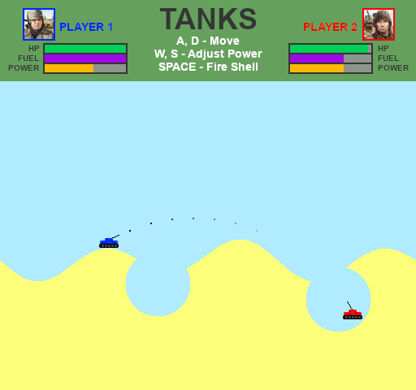

# C-Tanks
Classic tanks game with destructible terrain. The game uses quadtrees and pixel-perfect collision to simulate a destructible environment. You can press "G" to view the quadtree. I made this as an exercise to learn about quadtrees and the SDL library. For now the Makefile only works on Linux distributions, however I may update this to build for Windows too.


## **Install dependencies:**
Arch:
```
# pacman -S base-devel
# pacman -S sdl2 sdl2_image
```

Debian/Ubuntu:
```
# apt install build-essential
# apt install libsdl2-dev libsdl2-image-dev
```


## **Compile and run:**
```
$ make
$ cd build
$ ./tanks
```


## **Preview:**
